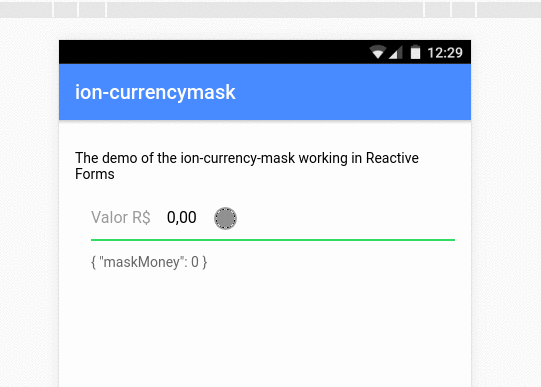

# Ionic CurrencyMask
<p align="center">
  
</p>

## Installation

To install ,ion-currencymask run:

```bash
$ npm install @pluritech/ion-currencymask --save
```

## Consuming your library

and then from your Angular `AppModule`:

```typescript
import { BrowserModule } from '@angular/platform-browser';
import { NgModule } from '@angular/core';
import { IonicApp, IonicErrorHandler, IonicModule } from 'ionic-angular';

import { HomePage } from '../pages/home/home';

// Import the library
import { IonCurrencyMaskModule } from '@pluritech/ion-currencymask';

@NgModule({
  declarations: [
    HomePage
  ],
  imports: [
    BrowserModule,
    IonicModule,
    // Import the module
    IonCurrencyMaskModule
  ],
  providers: [],
  bootstrap: [IonicApp]
})
export class AppModule { }
```

Once your library is imported, you can use its components in your Ionic application: This exemple used on code of showed in demo above

```xml
<!-- You can now use your library component in home.html -->
<ion-content padding>
  <p>
    The demo of the ion-currency-mask working in Reactive Forms
  </p>
  <form [formGroup]="formTest" (ngSubmit)="onSubmit()" >
    <ion-list>
      <!--the selector ion-currency-mask already has an ion-item themselves-->
      <ion-currency-mask
        placeholder="Insira o valor aqui"
        label="Valor R$"
        formControlName="maskMoney">
      </ion-currency-mask>
      <ion-item>
        <p>{{formTest.value | json}}</p>
      </ion-item>
    </ion-list>
  </form>
</ion-content>
```
In controller page
```typescript
// ... Hidden unnecessary code
export class HomePage {

  public formTest: FormGroup;

  constructor(public navCtrl: NavController, private formBuilder: FormBuilder) {
    this.formTest = formBuilder.group({
      maskMoney: ['', Validators.required]
    });
  }
  // ... Hidden unnecessary code
}
```

## Parameters to selector ion-currency-mask
| Parameter        | Type |         Description           |
| ------------- |:-------------:| :-------------:|
| placeholder   | string   | a value to placeholder of ion-input |
| label         | string   | a value to ion-label |
| typeLabel     | string   | a type to ion-label. Values: **stacked** - **fixed** - **floating** . More info: [Ionic Doc - Label](https://ionicframework.com/docs/api/components/label/Label/)      |
| clearInput    | boolean  | **true** to add clearInput on ion-input. **Default: false** without clearInput . More info: [Ionic Doc - Input](https://ionicframework.com/docs/api/components/input/Input/) |
| lastChild     | boolean  | if the ion-currency-mask is the last of ion-list send **true**, **Default: false**       |
| disabled      | boolean  | **true** to disabled the input. **Default: false**       |

## To do?

Feel free to make your pull request, chip in to suggestion or report issues.

## Thanks
We used the core code made by [Marlos Irapuan](https://github.com/marlosirapuan) inspired on http://jsbin.com/heqeduyi/1/edit?html,output and we maked improvement to separate into pieces of thousands. 
More info see: [MaskMoney no Ionic 2](https://marlosirapuan.com/maskmoney-no-ionic-2/)

## License

MIT © [Lucas Correa](mailto:lucasccorrea@gmail.com)
